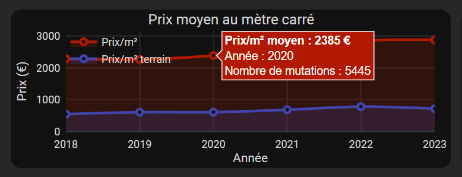

# :house: DVF Immobilier

L'application **[DVF Immobilier](https://dvf-real-estate.tlechatelier.fr)** est un **tableau de bord** des **transactions immobilières** en **France**, qui incorpore un outil **d'intelligence artificielle** pour la prédiction de prix de biens immobiliers.

> **Attention :**
> :warning: Il est fortement recommandé d'utiliser l'application sur ordinateur. :warning:

<i>Application DVF Immobilier</i>

## I. :star: Contexte

L'application DVF Immobilier rend **la visualisation des transactions immobilières (ou mutations) fluide et accessible à tous**. On y trouve les données liées aux maisons et aux appartements vendus en France (hors Moselle (57), Bas-Rhin (67), Haut-Rhin (68) et Mayotte (976)), au cours des **5 dernières années**.

Les données utilisées sont fournies par le gouvernement et sont connues sous le nom [DVF](https://www.data.gouv.fr/fr/datasets/demandes-de-valeurs-foncieres/) disponible en *Licence Ouverte*. 
**Les données présentes dans l'application ont été retraitées et agrégées** afin de fournir une meilleure qualité de lecture pour l'utilisateur.

## II. :dart: Fonctionnalités

L'application se présente sous forme de tableau de bord. Les données sont facilement exploitables à travers une **interface simple d'utilisation** qui est composée d'une unique page.

Les fonctionnalités se décomposent en **4 grandes catégories** :
1. La visualisation d'indicateurs immobiliers.
2. Filtres classiques.
3. Filtres intelligents intégrés aux graphiques.
4. Un outil d'intelligence artificielle pour prédire le prix d'un bien immobilier

### 1. 	:bar_chart: La visualisation d'indicateurs immobiliers

<i>Application DVF Immobilier - Graphiques</i>

L'application dispose de **6 visuels** mettant en valeur différents critères liés aux transactions immobilières :
1. Carte satellite (carte choroplèthe) du territoire français *(en haut à gauche)*. 
2. Prix au mètre carré sur l'ensemble des données sélectionnées *(en haut à droite)*. 
3. Nombre de mutations/transactions sélectionnées par les filtres *(au milieu à droite)*. 
4. Camembert sur la répartition du nombre de pièces principales sur l'ensemble des données sélectionnées *(au milieu à droite)*. 
5. Evolution du prix au mètre carré en fonction du temps *(en bas à gauche)*. 
6. Evolution du prix au mètre carré selon la surface *(en bas à droite)*.

<i>Application DVF Immobilier - Pop-up d'information</i>

De plus, sur chaque visuel, des **informations supplémentaires sont disponibles** en passant la souris sur les zones de couleur relatives aux données.

### 2. 	:mag_right: Filtres classiques

<i>Application DVF Immobilier - Filtres</i>

Il existe **4 types de filtres classiques** qui permettent de modifier les indicateurs visuels suivants :
* Le **département**.
* Le **type de bien** (maison ou appartement).
* La **période d'affichage** des données.
* Le **type de représentation** :
  * **Plage** : agrégation par commune.
  * **Point** : transaction visible individuellement, **les points en gris** sont des points avec de multiples valeurs et l'utilisateur peut **cliquer dessus pour avoir plus d'informations**.

<i>Application DVF Immobilier - Vue par plage / point</i>

### 3. :computer_mouse: Filtres intelligents intégrés aux graphiques

<i>Application DVF Immobilier - Graphiques avec filtres activés</i>

Sur les **visuels 1, 4 et 6**, il est possible de **cliquer sur les zones de couleur** représentant des données pour ajouter un filtre et affiner les résultats.

Pour désélectionner un filtre il suffit de re-cliquer sur la zone sélectionnée.

### 4. :chart_with_upwards_trend: Un outil d'intelligence artificielle pour prédire le prix d'un bien immobilier

Pour afficher **le menu de prédiction/estimation** il suffit de cliquer sur le bouton  en haut à droite.

<i>Application DVF Immobilier - Onglet de prédiction</i>

Pour prédire le prix d'un bien immobilier il faut renseigner certaines informations :
* Le **type de bien**.
* L'**adresse**.
* La **surface** en m².
* La **surface du terrain** en m² (exclusivement pour les maisons).
* Le **nombre de pièces principales**.

Une fois les informations remplies, il suffit de cliquer sur le bouton **Calcul** pour faire apparaître l'estimation du prix.

<i>Application DVF Immobilier - Prédiction</i>

Un algorithme **d'intelligence artificielle** a été entraîné sur les données existantes afin de fournir un résultat le plus proche possible de la réalité. 
L'estimation du prix d'un bien immobilier est donnée à titre indicatif et fonctionne exclusivement en **France métropolitaine**.

## III. :pencil: Licences

:warning: **L'utilisation de cette application à des fins commerciales est strictement interdite.** :warning:

## IV. :satellite: Auteur

Vous pouvez me contacter si vous avez des questions supplémentaires ou si vous avez détecté un bug à **timothe.lechatelier@gmail.com**

Et maintenant c'est à vous de prendre la main... :raised_hand_with_fingers_splayed:

**Timothé Le Chatelier**

  

